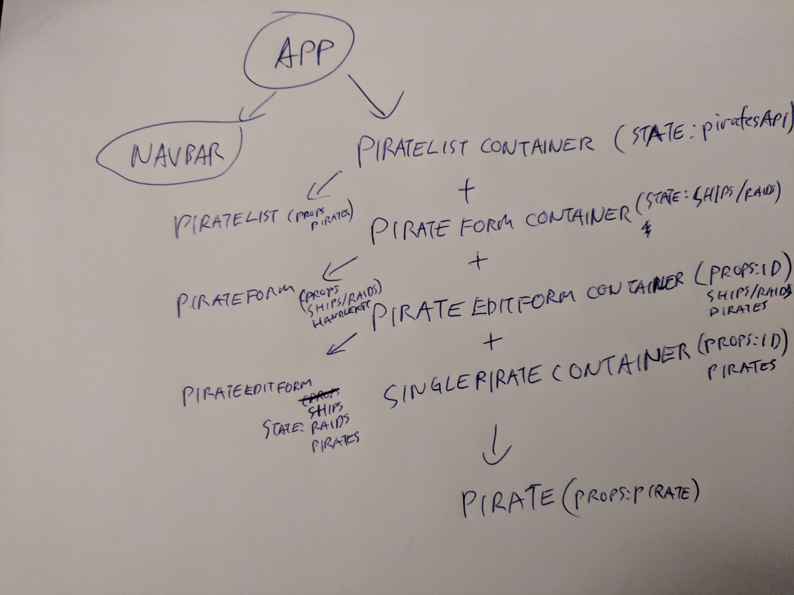

# Answers

## Task 1

## Task 2
### How do `PirateEditFormContainer` and `SinglePirateContainer` get the `id` of the selected pirate?

In both cases, the id is passed down in the Props from the App.js.

### Where are the requests made?

The requests to the API are made in the componentDidMount functions of their respective components.

## Task 3

* http://localhost:8080/api/ships/
* http://localhost:8080/api/raids/
* http://localhost:8080/api/pirates/
* http://localhost:8080/api/pirates/:id
* http://localhost:8080/api/pirates/new/
* http://localhost:8080/api/pirates/edit/:id
